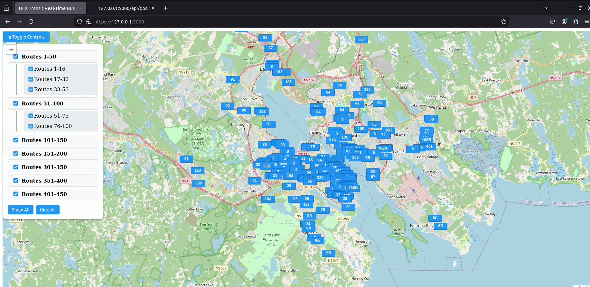

# Halifax Real-Time Bus Tracker 🚌📍

[](https://opensource.org/licenses/MIT)

A real-time visualization tool for Halifax Transit buses using GTFS-realtime data.

Made by Dane Ramirez as a quick personal learning project.

 

## Features ✨
- Live bus positions on interactive map
- Filter buses by route number ranges
- Vehicle details popups with speed/direction
- Automatic updates every 15 seconds
- Collapsible category controls
- Mobile-responsive design

## Installation 💻

### Prerequisites
- Python 3.9+
- Node.js (for future frontend builds)
- Git

### System used
- Ubuntu Linux System On VMWare
### Quick Start
```bash
# Clone repository
git clone https://github.com/yourusername/halifax-bus-tracker.git
cd halifax-bus-tracker

# Run setup script
chmod +x setup.sh
./setup.sh

# Start application
source venv/bin/activate
python app.py
```
## Security Notes 🔒
⚠️ Important Security Warning 

- This project contains temporary SSL workarounds for development purposes:

- Self-Signed Certificates Generated during setup for local HTTPS server

- API Verification Bypass
Disabled SSL verification for Halifax Transit's API:

```python
response = requests.get(url, verify=False)
```
- Mixed-Content Handling
Browser security exceptions required for local testing

## Production Requirements
For public deployment, you must:

- Obtain valid certificates from a trusted CA

- Remove verify=False from API requests

- Configure proper SSL settings:

```python
Copy
context = (
    "/etc/letsencrypt/live/YOURDOMAIN.COM/fullchain.pem",
    "/etc/letsencrypt/live/YOURDOMAIN.COM/privkey.pem"
)
```
- Use a reverse proxy (Nginx/Apache) with security headers


# Disclaimer: This Project is not affiliated with Halifax Regional Municipality.
## Do note This is a project designed for my own personal education